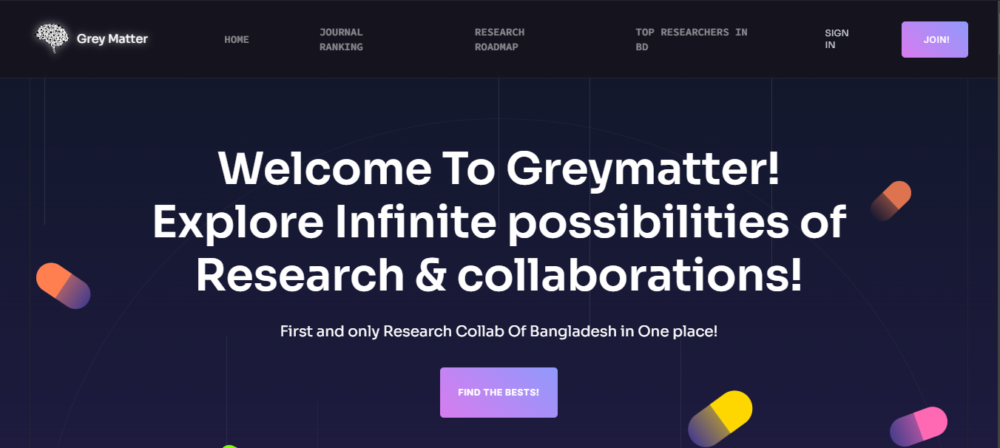
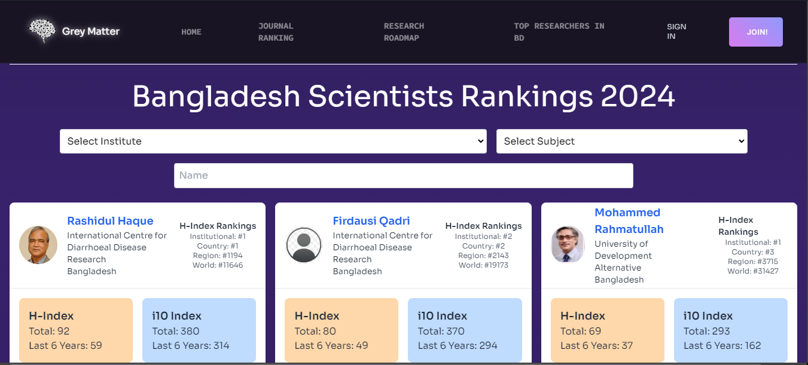
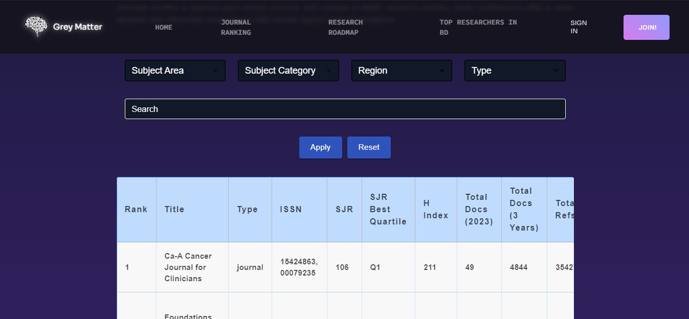

🧠 # Grey Matter - Researcher & Journal Finder

This repository contains the code corresponding to a collaborative project for Hackathon run by the HackCSB team in partnership with Coding Shikhbe Bangladesh, Bangladesh's fastest-growing AI-powered EdTech Platform [**HackCSB**](https://hackcsb.devpost.com/?ref_content=default&ref_feature=challenge&ref_medium=portfolio).  
You can visit the corresponding website from this link: [**Grey Matter**](https://grey-matter-omega.vercel.app/).  


## 📋 Table of Contents

1. 🤖 [Introduction](#introduction)
2. 🎨 [Inspiration](#inspiration)
3. 💡 [What it does](#features)
4. 🛠️ [How we built it](#tech)
5. 🚧 [Challenges we ran into](#challenges)
6. 🏆 [Accomplishments we're proud of](#accomplishments)
7. 🎓 [What we learned](#learn)
8. 🤸 [Quick Start](#quick-start)
9. 🔮 [What's next](#next)
10. 🛠️ [Built With](#built-with)
11. 🚀 [Try it out](#try)
12. 🔗 [Data Sources](#data-sources)

---

## 🤖 Introduction

**Grey Matter** is a comprehensive platform designed to facilitate the discovery of top-tier researchers from Bangladesh and provide detailed insights into academic journals worldwide.  
Developed using **React JS**, **Tailwind CSS**, **Express JS**, and **Vite**, this website serves as an essential tool for novice researchers, academic professionals, students, and researchers seeking to connect with influential figures in their fields or explore journals by various key metrics.  

Whether you're looking to collaborate with leading researchers or find journals that align with specific Sustainable Development Goals (SDGs), **Grey Matter** offers a streamlined, user-friendly experience.

---

## 🎨 Inspiration

The idea behind **Grey Matter** was inspired by the need to bridge the gap between researchers in Bangladesh and the global academic community.  

Upon stepping into the vast world of research, many become clueless. There are no visible guidelines on the *Know-How's* of research, no dedicated platform to learn about journals and conferences, and no resource to highlight Bangladesh’s top academic minds. They remain in the shadows.  

We said **NO** to this lack of visibility and created **Grey Matter** to bring these minds into the limelight. We aim to close the knowledge gap and eliminate the feeling of hopelessness that often plagues early-stage researchers.

---

## 💡 What it does

- **Researcher Database**  
  - The first dedicated platform to highlight top-class researchers from Bangladesh.  
  - Filter and search researchers based on various criteria such as expertise, affiliation, and research impact.

- **Global Journal Search**  
  - Explore academic journals worldwide with detailed information.  
  - Search by region, subject category, impact factor, and alignment with SDGs.

- **Research Roadmaps and Guidelines**  
  - A **comprehensive** research roadmap, from beginner to intermediate level.  
  - Step-by-step guidelines on research processes, from literature review to publication.  
  - Ethical standards, citation practices, and data management requirements.

- **User-Friendly Interface**  
  - **React JS** and **Tailwind CSS** ensure a smooth and responsive UI.

- **Advanced Search Filters**  
  - Robust filtering for relevant researcher and journal searches.

- **Real-Time Data Access**  
  - Up-to-date researcher and journal information.  

---

## 🛠️ How we built it

- **Frontend**: React JS for dynamic, interactive UI.  
- **Styling**: Tailwind CSS for responsive, clean design.  
- **Backend**: Express JS for data processing.  
- **Build Tool**: Vite for optimized performance.  
- **Data Sources**: SCImago Journal Rank & AD Scientific Index.  
- **Advanced Filtering**: Efficient search through large datasets.

---

## 🚧 Challenges we ran into

- Aggregating data from multiple sources while ensuring accuracy.  
- Building an efficient search & filtering mechanism.  
- Maintaining performance with large datasets.  
- Keeping real-time updates without compromising platform stability.  
- Implementing a complex yet smooth **Front-End design**.  
- Maintaining **color consistency** and UI standards across pages.  

---

## 🏆 Accomplishments we're proud of

- Successfully built Bangladesh’s **first** research discovery platform.  
- Integrated a **comprehensive research guide** for beginners.  
- Developed a **seamless UI** for an enhanced user experience.  
- Real-time data access for up-to-date information.  

**Screenshots:**  
  
*Snippets of Home Screen*  

  
*Snippets of Researchers Profile Screen*  

  
*Snippets of Journal Ranking Screen*  

---

## 🎓 What we learned

- **Data integration challenges** and ensuring data consistency.  
- **Complex Front-End Design** and smooth user experience.  
- **Performance Optimization** with large datasets.  
- **User-Centric Design** for accessibility.  
- **Responsive Web Development** while maintaining design standards.  
- **Team Collaboration** and effective project management.  

---

## 🤸 Quick Start

### **Prerequisites**
Ensure you have:  
- [Git](https://git-scm.com/)  
- [Node.js](https://nodejs.org/en)  
- [npm](https://www.npmjs.com/)  

### **Cloning the Repository**
```bash
git clone https://github.com/pr0ximaCent/Grey-Matter.git
cd Grey-Matter
```

### **Installation**
```bash
npm install
```

### **Running the Project**
```bash
npm run dev
```

Open [http://localhost:5173](http://localhost:5173) in your browser.

---

## 🔮 What's next

We plan to expand **Grey Matter** with:  
- **Personalized Researcher Recommendations**  
- **Integration with Academic Networks**  
- **Real-Time Collaboration Tools**  
- **Expanded Global Researcher Database**  

---

## 👥 Team Members

- **[Sabik Aftahee](https://github.com/pr0ximaCent)**
- **[Tofayel Ahmmed Babu](https://github.com/5pace4)**
- **[Md. Refaj Hossan](https://github.com/RJ-Hossan)**
- **[Abu Md. Masbah Uddin](https://github.com/ma5bah)**

---

## 🛠️ Built With

- **React.js** - Interactive UI  
- **Tailwind CSS** - Responsive Styling  
- **Express JS** - Backend Processing  
- **Vite** - Optimized Build Tool  
- **SCImago Journal Rank** - Journal Data  
- **AD Scientific Index** - Researcher Profiles  

---

## 🚀 Try it out

Check out **Grey Matter** live: [Live Demo](https://grey-matter-beta.vercel.app/)

---

## 🔗 Data Sources

**Grey Matter** aggregates data from trusted sources for accurate researcher and journal insights.  
